```{r setup, include=FALSE}
knitr::opts_chunk$set(
  echo = TRUE,
  eval = FALSE,
  comment = "#",
  error = FALSE,
  message = FALSE,
  warning = FALSE)
```

# Introducción

_Tesltra Corporation Limited_ (TELSTRA) es una de las mayores empresas operadoras
de telecomunicaciones de Australia, ofreciendo servicios de telefonía, móvil,
acceso a Internet, televisión por cable y otros productos de entretenimiento.
Siendo poseedora de una de las mayores redes de telecomunicaciones a nivel
global, almacenan gran cantidad de _logs_ sobre el funcionamiento y los fallos
de ésta. Uno de los principales retos de las operadoras de telecomunicaciones
es ofrecer la mejor calidad de servicio a sus clientes, previendo posibles
fallos y optimizando la asignación de recursos para el mantenimiento de sus
redes de telecomunicaciones. Basándose en los datos aportados por TELSTRA, el
objetivo de este proyecto es predecir si una interrupción del servicio será un
fallo momentáneo o una interrupción total de la conectividad, según los grados
de severidad aportados por la compañía en los _datasets_.

El problema planteado pertenece a una competición organizada por TELSTRA en
plataforma _Kaggle_[^1] y para su resolución se deberán subir distintas
soluciones generadas por los modelos desarrollados, en un formato concreto,
que serán evaluadas aplicando la _pérdida logarítmica multi clase_, definida
como:

$$logloss = -\frac{1}{N}\displaystyle\sum_{i=1}^{N}\displaystyle\sum_{j=1}^{M}y_{ij}log(p_{ij})$$

# Estructura del proyecto en R

Para el desarrollo del proyecto, se utilizará de forma exclusiva el lenguaje
de programación _R_ y las herramientas integradas en el entorno de desarrollo
_RStudio_[^2].

Toda la información sobre la estructura del proyecto estará contenida en el
fichero _TelstraNetworkDisruptions.Rproj_ que puede ser abierto fácilmente
utilizando _RStudio_. La jerarquía de carpetas se detalla a continuación:

* __data__: Contiene todos los _datasets_ que se pueden descargar desde la
web de la competición en _Kaggle_ en formato `.zip`, así como los ficheros
originales descomprimidos en formato `.csv`.
    * __features__: Aquí encontraremos tanto ficheros `.csv` como ficheros
    `.Rdata` (contenedor de datos utilizado por _R_) con las _features_
    generadas durante el desarrollo del proyecto y que serán descritos a lo
    largo de este documento.
* __doc__: Contiene documentos `.pdf` con información relevante sobre el
proyecto, como, por ejemplo, este documento.
* __model__: Aquí se podrán encontrar los distintos modelos predictivos
generados durante el transcurso del proyecto, en formato válido para ser
utilizados en _R_.
* __res__: Esta carpeta contiene tanto ficheros `.csv` con resultados de
predicciones generadas por los modelos desarrollados que se han subido a la
plataforma _Kaggle_ para su puntuación como ficheros `.png` con gráficas que
nos ayudarán a entender los pasos seguidos en el análisis de datos y la
evaluación de los modelos.
* __src__: Aquí se podrá encontrar todo el código fuente en ficheros `.R` que
se ha creado para el desarrollo de este proyecto y es mencionado en este
documento.

# Análisis de los datos

Una vez descargados los _datasets_ desde la web de la competición y almacenados
en el directorio __data__, pasamos a descomprimirlos. Para ello podemos
utilizar el siguiente código que automatiza el proceso, o podemos optar por
descomprimirlos manualmente.

```{r}
zipFiles <- dir(path = "data", pattern = "\\.zip")
zipFiles

unzipDataFiles <- function(zipFiles) {
  for (file in zipFiles) {
    unzip(paste(c("data/"), file, sep = ""), exdir = "data")
  }
}

unzipDataFiles(zipFiles)
```

Una vez descomprimidos, nos encontramos con 5 ficheros `.csv` distintos:

* `data/log_feature.csv`
* `data/event_type.csv`
* `data/resource_type.csv`
* `data/severity_type.csv`
* `data/test.csv`
* `data/train.csv`
* `data/sample_submission.csv`

que pasaremos a estudiar a continuación.

## `data/log_feature.csv`

Cargamos el _dataset_ en memoria:

```{r echo=F,eval=T}
logFeatureData <- read.table(
  file = "../data/log_feature.csv",
  header = T,
  sep = ",",
  stringsAsFactors = F)
```
```{r}
logFeatureData <- read.table(
  file = "data/log_feature.csv",
  header = T,
  sep = ",",
  stringsAsFactors = F)
```

```{r eval=T}
head(logFeatureData)
tail(logFeatureData)

summary(logFeatureData)

str(logFeatureData)

dim(logFeatureData)

length(unique(logFeatureData$id))
length(unique(as.factor(logFeatureData$log_feature)))
length(unique(logFeatureData$volume))
```

Observamos que el _dataset_ se compone de 58671 filas y 3 columnas:

* __id__: con 18552 entradas distintas de tipo numérico.
* __log_feature__: con 386 _features_ distintas de tipo carácter cuya parte
descriptiva es un número.
* __volume__: con 341 entradas distintas de tipo numérico.

## `data/event_type.csv`

Cargamos el _dataset_ en memoria:

```{r echo=F,eval=T}
eventTypeData <- read.table(
  file = "../data/event_type.csv",
  header = T,
  sep = ",",
  stringsAsFactors = F)
```
```{r}
eventTypeData <- read.table(
  file = "data/event_type.csv",
  header = T,
  sep = ",",
  stringsAsFactors = F)

```

```{r eval=T}
head(eventTypeData)
tail(eventTypeData)

summary(eventTypeData)

str(eventTypeData)

dim(eventTypeData)

length(unique(eventTypeData$id))
length(unique(as.factor(eventTypeData$event_type)))
```

Observamos que el _dataset_ se compone de 31170 filas y 2 columnas:

* __id__: con 18552 entradas distintas de tipo numérico.
* __event_type__: con 53 _features_ distintas de tipo carácter cuya parte
descriptiva es un número.

## `data/resource_type.csv`

Cargamos el _dataset_ en memoria:

```{r echo=F,eval=T}
resourceTypeData <- read.table(
  file = "../data/resource_type.csv",
  header = T,
  sep = ",",
  stringsAsFactors = F)
```
```{r}
resourceTypeData <- read.table(
  file = "data/resource_type.csv",
  header = T,
  sep = ",",
  stringsAsFactors = F)
```

```{r eval=T}
head(resourceTypeData)
tail(resourceTypeData)

summary(resourceTypeData)

str(resourceTypeData)

dim(resourceTypeData)

length(unique(resourceTypeData$id))
length(unique(as.factor(resourceTypeData$resource_type)))
```

Observamos que el _dataset_ se compone de 21076 filas y 2 columnas:

* __id__: con 18552 entradas distintas de tipo numérico.
* __resource_type__: con 10 _features_ distintas de tipo carácter cuya parte
descriptiva es un número.

## `data/severity_type.csv`

Cargamos el _dataset_ en memoria:

```{r echo=F,eval=T}
severityTypeData <- read.table(
  file = "../data/severity_type.csv",
  header = T,
  sep = ",",
  stringsAsFactors = F)
```
```{r}
severityTypeData <- read.table(
  file = "data/severity_type.csv",
  header = T,
  sep = ",",
  stringsAsFactors = F)
```

```{r eval=T}
head(severityTypeData)
tail(severityTypeData)

summary(severityTypeData)

str(severityTypeData)

dim(severityTypeData)

length(unique(severityTypeData$id))
length(unique(as.factor(severityTypeData$severity_type)))
```

Observamos que el _dataset_ se compone de 18552 filas y 2 columnas:

* __id__: con 18552 entradas distintas de tipo numérico.
* __severity_type__: con 5 _features_ distintas de tipo carácter cuya parte
descriptiva es un número.

En este punto nos podemos hacer a la idea de que el conjunto de __datasets__ nos
presenta información para 18552 eventos distintos registrados en los _logs_ de
TELSTRA.

## `data/test.csv`

Cargamos el _dataset_ en memoria:

```{r echo=F,eval=T}
testData <- read.table(
  file = "../data/test.csv",
  header = T,
  sep = ",",
  stringsAsFactors = F)
```
```{r}
testData <- read.table(
  file = "data/test.csv",
  header = T,
  sep = ",",
  stringsAsFactors = F)
```

```{r eval=T}
head(testData)
tail(testData)

summary(testData)

str(testData)

dim(testData)

length(unique(testData$id))
length(unique(as.factor(testData$location)))
```

Observamos que el _dataset_ de _test_ se compone de 11171 filas y 2 columnas:

* __id__: con 11171 entradas distintas de tipo numérico.
* __location__: con 1039 localizaciones distintas de tipo carácter que, al
igual que los _datasets_ anteriores se muestran con la etiqueta _location_ y
un número descriptivo.

## `data/train.csv`

Cargamos el _dataset_ en memoria:

```{r echo=F,eval=T}
trainData <- read.table(
  file = "../data/train.csv",
  header = T,
  sep = ",",
  stringsAsFactors = F)
```
```{r}
trainData <- read.table(
  file = "data/train.csv",
  header = T,
  sep = ",",
  stringsAsFactors = F)
```

```{r eval=T}
head(trainData)
tail(trainData)

summary(trainData)

str(trainData)

dim(trainData)

length(unique(trainData$id))
length(unique(as.factor(trainData$location)))
length(unique(trainData$fault_severity))

length(unique(c(trainData$id, testData$id)))
length(unique(c(trainData$location, testData$location)))
```

Observamos que el _dataset_ de _test_ se compone de 7381 filas y 3 columnas:

* __id__: con 7381 entradas distintas de tipo numérico.
* __location__: con 929 localizaciones distintas con el mismo formato que el
_dataset_ de _test_.
* __fault_severity__: con 3 grados de gravedad de fallo, numerados del 0 al 2.

Si combinamos los _datasets_ de _training_ y _test_ tenemos de nuevo 18552
__id__ y hasta 1126 __location__ distintas entre los dos.

## `data/sample_submission.csv`

Cargamos el _dataset_ en memoria:

```{r echo=F,eval=T}
sampleSubmissionData <- read.table(
  file = "../data/sample_submission.csv",
  header = T,
  sep = ",",
  stringsAsFactors = F)
```
```{r}
sampleSubmissionData <- read.table(
  file = "data/sample_submission.csv",
  header = T,
  sep = ",",
  stringsAsFactors = F)
```

```{r eval=T}
head(sampleSubmissionData)
tail(sampleSubmissionData)

summary(sampleSubmissionData)

str(sampleSubmissionData)

dim(sampleSubmissionData)

length(unique(sampleSubmissionData$id))
```

En este ejemplo de _submission_ se nos indica que los resultados deberán ir
agrupados en cuatro columnas:

* __id__: entrada para la que se realiza la predicción.
* __predict_0__: la probabilidad que nuestro modelo calcule para el grado 0 de
fallo para la entrada predicha.
* __predict_1__: la probabilidad que nuestro modelo calcule para el grado 1 de
fallo para la entrada predicha.
* __predict_2__: la probabilidad que nuestro modelo calcule para el grado 2 de
fallo para la entrada predicha.

# Creando variables

El formato que presenta nuestros ficheros no es manejable para aplicar técnicas
predictivas. Cada fichero tiene una longitud distinta y los tipos de datos
no aportan linearidad. Por esta razón, el primer paso será crear conjuntos
de datos que describan de forma más eficiente y numérica los _logs_ aportados,
agrupando esta nueva información por __id__.

## Variables estadísticas

En primer lugar vamos a crear __estadísticos__ que nos permitan describir
los datos de forma más eficiente para cada una de las _features_ que aparecen
en nuestros _datasets_.

### Contador de apariciones de _features_

En primer lugar vamos a generar un nuevo _dataset_ con el número de apariciones
de _features_ distintas definidas en cada _dataset_ para cada __id__.

```{r}
require(data.table)

et <- fread(input = "data/event_type.csv")
st <- fread(input = "data/severity_type.csv")
rt <- fread(input = "data/resource_type.csv")
lf <- fread(input = "data/log_feature.csv")

count_et <- et[, .(count_event_type = length(unique(event_type))), by = id]
count_st <- st[, .(count_severity_type = length(unique(severity_type))), by = id]
count_rt <- rt[, .(count_resource_type = length(unique(resource_type))), by = id]
count_lf <- lf[, .(count_log_feat = length(unique(log_feature))), by = id]
count_vol <- lf[, .(count_log_vol = length(unique(volume))), by = id]

tmp <- merge(count_et, count_st, all = T, by = "id")
tmp <- merge(tmp, count_rt, all = T, by = "id")
tmp <- merge(tmp, count_lf, all = T, by = "id")
tmp <- merge(tmp, count_vol, all = T, by = "id")

colnames(tmp) <- c("id", "count_et", "count_st", "count_rt", "count_lf", "count_vol")

write.csv(tmp, file = "data/features/count_feats.csv", quote = F, row.names = F)
```

Este es el nuevo _dataset_ generado:

```{r echo=F,eval=T}
require(data.table)
count_feats <- fread("../data/features/count_feats.csv")
count_feats
```

Observamos que para cada __id__, ahora tenemos:

* Número de __event_type__ distintos.
* Número de __severity_type__ distintos.
* Número de __resource_type__ distintos.
* Número de __log_feature__ distintos.
* Número de __volume__ distintos.

### Suma de _features_

A continuación, sumamos todos los valores de las distintas _features_ que
tenemos para cada __id__. Parece que el número que describe a las columnas
de tipo carácter podría ser importante, por lo tanto, y para diferenciarlo
del conteo anterior, separamos el número del resto del texto y lo asignamos
como valor de dicha característica para su posterior suma.

```{r}
require(data.table)

splitAndSum <- function(x) {
  sum(as.numeric(unlist(lapply(strsplit(x, " "), function(x) x[2]))))
}

test_train <- rbind(train, test)

et <- fread(input = "data/event_type.csv")
st <- fread(input = "data/severity_type.csv")
rt <- fread(input = "data/resource_type.csv")
lf <- fread(input = "data/log_feature.csv")

sum_et <- et[, .(sum_event_type = splitAndSum(event_type)), by = id]
sum_st <- st[, .(sum_severity_type = splitAndSum(severity_type)), by = id]
sum_rt <- rt[, .(sum_resource_type = splitAndSum(resource_type)), by = id]
sum_lf <- lf[, .(sum_log_feat = splitAndSum(log_feature)), by = id]
sum_vol <- lf[, .(sum_log_vol = sum(volume)), by = id]

tmp <- merge(sum_et, sum_st, all = T, by = "id")
tmp <- merge(tmp, sum_rt, all = T, by = "id")
tmp <- merge(tmp, sum_lf, all = T, by = "id")
tmp <- merge(tmp, sum_vol, all = T, by = "id")

colnames(tmp) <- c("id", "sum_et", "sum_st", "sum_rt", "sum_lf", "sum_vol")

write.csv(tmp, file = "data/features/sum_feats.csv", quote = F, row.names = F)
```
Este es el nuevo _dataset_ generado:

```{r echo=F,eval=T}
require(data.table)
sum_feats <- fread("../data/features/sum_feats.csv")
sum_feats
```

Para cada __id__, ahora tenemos:

* Suma de __event_type__.
* Suma de __severity_type__.
* Suma de __resource_type__.
* Suma de __log_feature__.
* Suma de __volume__.

### Media de _features_

Siguiendo el principio de particionado de las columnas de tipo carácter y
el uso de la parte numérica como valor de la _feature_ que utilizamos en el
apartado anterior, generamos la media de valores de _features_ que tenemos
para cada __id__.

```{r}
require(data.table)

splitAndMean <- function(x) {
  mean(as.numeric(unlist(lapply(strsplit(x, " "), function(x) x[2]))))
}

test_train <- rbind(train, test)

et <- fread(input = "data/event_type.csv")
st <- fread(input = "data/severity_type.csv")
rt <- fread(input = "data/resource_type.csv")
lf <- fread(input = "data/log_feature.csv")

mean_et <- et[, .(mean_event_type = splitAndMean(event_type)), by = id]
mean_st <- st[, .(mean_severity_type = splitAndMean(severity_type)), by = id]
mean_rt <- rt[, .(mean_resource_type = splitAndMean(resource_type)), by = id]
mean_lf <- lf[, .(mean_log_feat = splitAndMean(log_feature)), by = id]
mean_vol <- lf[, .(mean_log_vol = mean(volume)), by = id]

tmp <- merge(mean_et, mean_st, all = T, by = "id")
tmp <- merge(tmp, mean_rt, all = T, by = "id")
tmp <- merge(tmp, mean_lf, all = T, by = "id")
tmp <- merge(tmp, mean_vol, all = T, by = "id")

colnames(tmp) <- c("id", "mean_et", "mean_st", "mean_rt", "mean_lf", "mean_vol")

write.csv(tmp, file = "data/features/mean_feats.csv", quote = F, row.names = F)
```

A continuación el _dataset_ generado.

```{r echo=F,eval=T}
require(data.table)
mean_feats <- fread("../data/features/mean_feats.csv")
mean_feats
```

No hemos tenido errores al generar el _dataset_ (divisiones por cero),
por lo que podemos asegurar que cada __id__ tiene, al menos una _feature_ de
cada tipo presente. De esta manera ahora tenemos, para cada __id__:

* Media de __event_type__.
* Media de __severity_type__.
* Media de __resource_type__.
* Media de __log_feature__.
* Media de __volume__.

### Desviación estándar de _features_

Aplicamos el mismo procedimiento que en el apartado anterior, pero para obtener
la desviación estándar por _feature_ e __id__, nos aseguramos de no utilizar la
_corrección de Bessel_[^3], ya que en algunos casos tenemos que un __id__ sólo
tiene una _feature_ y eso generaría una indeterminación.

```{r}
require(data.table)

SD <- function(x) {
  x_mean <- mean(x)
  sqrt(sum(((x - x_mean)^2)/length(x)))
}

splitAndSD <- function(x) {
  SD(as.numeric(unlist(lapply(strsplit(x, " "), function(x) x[2]))))
}

test_train <- rbind(train, test)

et <- fread(input = "data/event_type.csv")
st <- fread(input = "data/severity_type.csv")
rt <- fread(input = "data/resource_type.csv")
lf <- fread(input = "data/log_feature.csv")

sd_et <- et[, .(sd_event_type = splitAndSD(event_type)), by = id]
sd_st <- st[, .(sd_severity_type = splitAndSD(severity_type)), by = id]
sd_rt <- rt[, .(sd_resource_type = splitAndSD(resource_type)), by = id]
sd_lf <- lf[, .(sd_log_feat = splitAndSD(log_feature)), by = id]
sd_vol <- lf[, .(sd_log_vol = SD(volume)), by = id]

tmp <- merge(sd_et, sd_st, all = T, by = "id")
tmp <- merge(tmp, sd_rt, all = T, by = "id")
tmp <- merge(tmp, sd_lf, all = T, by = "id")
tmp <- merge(tmp, sd_vol, all = T, by = "id")

colnames(tmp) <- c("id", "sd_et", "sd_st", "sd_rt", "sd_lf", "sd_vol")

write.csv(tmp, file = "data/features/sd_feats.csv", quote = F, row.names = F)
```

Aquí el nuevo __dataset__ generado:

```{r echo=F,eval=T}
require(data.table)
sd_feats <- fread("../data/features/sd_feats.csv")
sd_feats
```

Éste nos proporciona, para cada __id__:

* Desviación estándar de __event_type__.
* Desviación estándar de __severity_type__.
* Desviación estándar de __resource_type__.
* Desviación estándar de __log_feature__.
* Desviación estándar de __volume__.

### Mediana de _features_

Aplicamos el mismo procedimiento de _splitting_ y obtención de la parte numérica
para las _features_ necesarias y obtenemos la mediana para cada una de ellas,
agrupadas por __id__.

```{r}
require(data.table)

splitAndMedian <- function(x) {
  median(as.numeric(unlist(lapply(strsplit(x, " "), function(x) x[2]))))
}

test_train <- rbind(train, test)

et <- fread(input = "data/event_type.csv")
st <- fread(input = "data/severity_type.csv")
rt <- fread(input = "data/resource_type.csv")
lf <- fread(input = "data/log_feature.csv")

median_et <- et[, .(median_event_type = splitAndMedian(event_type)), by = id]
median_st <- st[, .(median_severity_type = splitAndMedian(severity_type)), by = id]
median_rt <- rt[, .(median_resource_type = splitAndMedian(resource_type)), by = id]
median_lf <- lf[, .(median_log_feat = splitAndMedian(log_feature)), by = id]
median_vol <- lf[, .(median_log_vol = as.double(median(volume))), by = id]

tmp <- merge(median_et, median_st, all = T, by = "id")
tmp <- merge(tmp, median_rt, all = T, by = "id")
tmp <- merge(tmp, median_lf, all = T, by = "id")
tmp <- merge(tmp, median_vol, all = T, by = "id")

colnames(tmp) <- c("id", "median_et", "median_st", "median_rt", "median_lf", "median_vol")

write.csv(tmp, file = "data/features/median_feats.csv", quote = F, row.names = F)
```
El nuevo _dataset_ quedaría como:

```{r echo=F,eval=T}
require(data.table)
median_feats <- fread("../data/features/median_feats.csv")
median_feats
```

Para cada __id__ tenemos:

* Mediana de __event_type__.
* Mediana de __severity_type__.
* Mediana de __resource_type__.
* Mediana de __log_feature__.
* Mediana de __volume__.

### Máximo de _features_

El siguiente paso es obtener el valor numérico máximo para cada _feature_
descrita en los _datasets_ para cada __id__. Para obtener este valor, aplicamos
el mismo procedimiento que en los apartados anteriores.

```{r}
require(data.table)

splitAndMax <- function(x) {
  max(as.numeric(unlist(lapply(strsplit(x, " "), function(x) x[2]))))
}

test_train <- rbind(train, test)

et <- fread(input = "data/event_type.csv")
st <- fread(input = "data/severity_type.csv")
rt <- fread(input = "data/resource_type.csv")
lf <- fread(input = "data/log_feature.csv")

max_et <- et[, .(max_event_type = splitAndMax(event_type)), by = id]
max_st <- st[, .(max_severity_type = splitAndMax(severity_type)), by = id]
max_rt <- rt[, .(max_resource_type = splitAndMax(resource_type)), by = id]
max_lf <- lf[, .(max_log_feat = splitAndMax(log_feature)), by = id]
max_vol <- lf[, .(max_log_vol = max(volume)), by = id]

tmp <- merge(max_et, max_st, all = T, by = "id")
tmp <- merge(tmp, max_rt, all = T, by = "id")
tmp <- merge(tmp, max_lf, all = T, by = "id")
tmp <- merge(tmp, max_vol, all = T, by = "id")

colnames(tmp) <- c("id", "max_et", "max_st", "max_rt", "max_lf", "max_vol")

write.csv(tmp, file = "data/features/max_feats.csv", quote = F, row.names = F)
```

Nuestro nuevo _dataset_ sería:

```{r echo=F,eval=T}
require(data.table)
max_feats <- fread("../data/features/max_feats.csv")
max_feats
```

Donde tenemos, para cada __id__:

* Máximo valor de __event_type__.
* Máximo valor de __severity_type__.
* Máximo valor de __resource_type__.
* Máximo valor de __log_feature__.
* Máximo valor de __volume__.

### Mínimo de _features_

Finalmente, aplicamos el mismo procedimiento para calcular el mínimo valor de
cada _feature_ por __id__. Cabe destacar, que, aunque sería aceptable, nos
encontraremos con que los resultados nunca serán 0, ya que, como hemos visto
anteriormente, cada __id__ tiene, al menos una _feature_ de cada tipo (_volume_,
_event type_, _severity type_, _resource type_ y _log feature_)

```{r}
require(data.table)

splitAndMin <- function(x) {
  min(as.numeric(unlist(lapply(strsplit(x, " "), function(x) x[2]))))
}

test_train <- rbind(train, test)

et <- fread(input = "data/event_type.csv")
st <- fread(input = "data/severity_type.csv")
rt <- fread(input = "data/resource_type.csv")
lf <- fread(input = "data/log_feature.csv")

min_et <- et[, .(min_event_type = splitAndMin(event_type)), by = id]
min_st <- st[, .(min_severity_type = splitAndMin(severity_type)), by = id]
min_rt <- rt[, .(min_resource_type = splitAndMin(resource_type)), by = id]
min_lf <- lf[, .(min_log_feat = splitAndMin(log_feature)), by = id]
min_vol <- lf[, .(min_log_vol = min(volume)), by = id]

tmp <- merge(min_et, min_st, all = T, by = "id")
tmp <- merge(tmp, min_rt, all = T, by = "id")
tmp <- merge(tmp, min_lf, all = T, by = "id")
tmp <- merge(tmp, min_vol, all = T, by = "id")

colnames(tmp) <- c("id", "min_et", "min_st", "min_rt", "min_lf", "min_vol")

write.csv(tmp, file = "data/features/min_feats.csv", quote = F, row.names = F)
```

Al igual que para el máximo, nuestro _dataset_ será:

```{r echo=F,eval=T}
require(data.table)
min_feats <- fread("../data/features/min_feats.csv")
min_feats
```

Para cada __id__ tendremos:

* Mínimo valor de __event_type__.
* Mínimo valor de __severity_type__.
* Mínimo valor de __resource_type__.
* Mínimo valor de __log_feature__.
* Mínimo valor de __volume__.

## Componentes principales

El _dataset_ más importante en extensión, de todos los aportados es, sin
duda, `log_feature.csv`, con sus más de 58000 filas y las columnas _log_feature_
y _volume_, de las que, la primera de ellas contiene más de 380 tipos diferentes
de valores categóricos posibles.

El _análisis de componentes principales_[^5] nos permitirá obtener el valor
informativo de estas variables, pero reduciendo su cantidad. Para ello nuestra
idea se basa en convertir el _dataset_ original en una nueva tabla que tenga
por filas cada uno de los __id__ y, como columnas, cada una de los valores
posibles de _log_feature_. En cada celda de esta nueva tabla tendremos el valor
_volume_ para dicha intersección.

Una vez calculada la matriz de rotación del _PCA_, multiplicamos
(matricialmente) cada fila con los valores de _log_feature_ para cada __id__,
obteniendo así los valores para cada componente principal.

```{r}
# install.packages(devtools)
library(devtools)
# Visualizacion PCA/clustering
# install_github("sinhrks/ggfortify")
# install_github("ggbiplot", "vqv")
library(ggbiplot)
# install.packages(corrplot)
library(corrplot)
library(ggplot2)
library(plyr)
require(reshape2)
##library(data.table)
library(dplyr)
require(stringr)
require(data.table)

stringToValue <- function(x) {
  for (i in 1:length(x)) {
    if (is.na(x[i]))
      x[i] <- 0
  }
  
  return(x)
}

lf.df <- read.table(
  file = "data/log_feature.csv",
  header = T,
  sep = ",",
  stringsAsFactors = F)


lf.df <- dcast(
  data = lf.df,
  formula = id ~ log_feature,
  value.var = "volume")

lf.df[, 2:ncol(lf.df)] <- as.numeric(
  apply(
    lf.df[, 2:ncol(lf.df)],
    2,
    stringToValue))

lf.dt <- as.data.table(lf.df)

lf.df.pca <- prcomp(lf.df[, 2:ncol(lf.df)])
lf.df.pca.var <- lf.df.pca$sdev^2
lf.df.pca.pve <- lf.df.pca.var/sum(lf.df.pca.var)

png(filename = "res/accPCA.png")
qplot(seq_along(lf.df.pca.pve),
      cumsum(lf.df.pca.pve),
      geom = c("point", "path"),
      xlab = "Componentes principales",
      ylab = "Proporción acumulada de Varianzas Explicadas")
dev.off()

tmp <- as.matrix(lf.df[, 2:ncol(lf.df)]) %*% lf.df.pca$rotation

tmp <- cbind(lf.df$id, tmp, 1)

colnames(tmp)[1] <- "id"

lf.dt.pca <- as.data.table(tmp)

save(lf.dt.pca, file = "data/features/log_features_pca.Rdata")
```

La nueva tabla de componentes principales por __id__ quedará de la siguiente
forma:

```{r echo=F,eval=T}
require(data.table)
load("../data/features/log_features_pca.Rdata")
lf.dt.pca[1:10, 1:6, with=F]
```

Además, como se puede observar en la _Figura 1_, en la que mostramos la
proporción acumulada de varianza explicada por componente principal, que las 10
primeras componentes principales describen más del 80 por ciento de la
información de nuestro conjunto de datos.

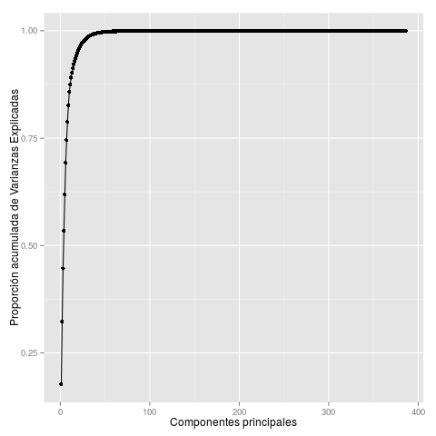

Comprobamos que nuestra nueva tabla tenga las dimensiones adecuadas:

```{r eval=T}
dim(lf.dt.pca)
```

Después de aplicar _PCA_, tenemos que la matriz de rotación nos indica la
importancia de cada _log_feature_ en cada una de las componentes de principales
de manera normalizada $[-1,1]$, siendo aquellas que tengán un valor más
próximo a los extremos, las que más información están proporcionando. Si a
esto le añadimos que `prcomp` ordena las componentes principales por valor
descriptivo, podemos tomar las 15 primeras componentes principales, sumar
el valor absoluto del valor de cada una de las _log_feature_ en cada
una de ellas y ordenar el resultado de mayor a menor. Las _log_feature_ mayores
serán aquellas que tienen mayor importancia descriptiva en `log_feature.csv`
(al menos para las 15 primeras componentes principales).

```{r}
tmp <- lf.df.pca$rotation

rownames(tmp) <- as.numeric(
  unlist(lapply(strsplit(rownames(tmp), " "), function(x) x[2])))

tmp <- cbind(as.numeric(rownames(tmp)), tmp)
colnames(tmp)[1] <- "id"

tmp.dt <- as.data.table(tmp)

tmp.dt.sum <- abs(tmp.dt)
tmp.dt.sum$sum <- rowSums(tmp.dt.sum[, 2:6, with = F])
tmp.dt.sum[order(-sum)][1:15, c(1,388), with = F]
```

```{r eval=T,echo=F}
require(data.table)
tmp.dt.sum <- fread("../data/features/log_features_pca_imp.csv")
tmp.dt.sum[order(-sum)][1:15, c(1,388), with = F]
```

El resultado de ésta operación se muestra en la tabla anterior y, en este
proyecto sólo lo utilizaremos como información descriptiva, que nos permitirá
decidir que _log_feature_ son más descriptivas en nuestro _dataset_.

## Buscando la variable mágica

En los foros de la competición, los participantes hablan de una o varias
variables mágicas que se pueden obtener, basadas en el orden inherente
a los _datasets_ aportados por TELSTRA. Es lógico pensar que si los _datasets_
describen los fallos de una red telecomunicaciones basada en localizaciones,
también estén estos datos ordenados en el tiempo.

En primer lugar, utilizando los _datasets_ de _training_ y _test_ vamos a
intentar comparar cada entrada en el _log_ (por __id__) respecto a su
localización.

```{r}
require(tm)
require(data.table)
require(ggplot2)
require(plyr)

train <- fread(input = "data/train.csv")
test <- fread(input = "data/test.csv")

splitLocation <- function(x) {
  as.numeric(unlist(lapply(strsplit(x, " "), function(x) x[2])))  
}

test$fault_severity <- -1

test_train <- rbind(train, test)

locations <- test_train[,
                        .(location = splitLocation(location),
                          fault_severity),
                        by = id]
locations <- locations[,
                       .(location,
                         fault_severity,
                         fs_factor = as.factor(fault_severity)),
                       by = id]

png(filename = "res/location_vs_id.png")
ggplot(data = locations, aes(x = location, y = id)) +
  geom_point(aes(color = fs_factor, alpha = fs_factor, size = fs_factor)) +
  scale_color_manual(
    name = "fault_severity",
    values = c("-1"="black", "0"="green", "1"="blue", "2"="red")) +
  scale_alpha_manual(
    name = "",
    values = c("-1"=0.8, "0"=0.7, "1"=0.7, "2"=0.7)) +
  scale_size_manual(values = c("-1"=0.5, "0"=2, "1"=2, "2"=2))
dev.off()
```

Como se puede observar en la _Figura 2_, parece que existe una cierta
agrupación de los datos en columnas. La variable _location_, por tanto, tendrá
un peso predictivo muy importante en nuestro modelo(s).

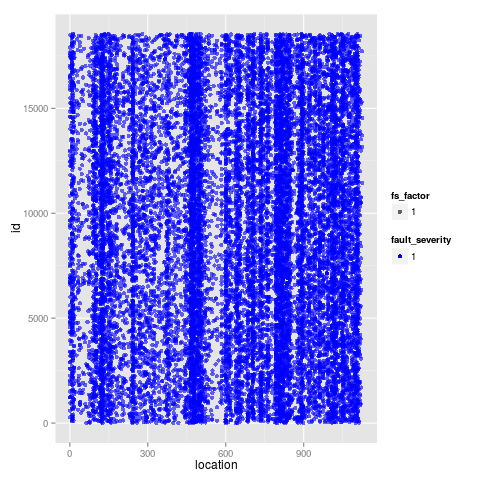

Añadimos al conjunto de datos el _dataset_ `severity_type.csv` ya que
contiene un registro por __id__ y no tenemos que prepararlo. Lo importante
es no variar el orden de los _datasets_ al hacer el _merge_.

A continuación agregamos un contador a cada aparición que aparezca agrupada
por _location_. Es decir, con el orden original de los datos, para cada
_location_ vamos a establecer el orden en el que aparecen los datos
originalmente de tres formas distintas:

* __sort__: orden incremental
* __revsort__: orden decremental
* __cumsort__: proporción acumulada de entradas que han aparecido hasta el
momento agrupdas por _location_.

```{r}
st <- fread(input = "data/severity_type.csv")
st <- st[, .(severity_type = splitLocation(severity_type)), by = id]

st <- merge(st, locations, all = T, by = "id", sort = F)
head(st, 100)
tail(st, 100)

st[, sort := c(1:.N), by = location]
st[, revsort := c(.N:1), by = location]
st[, cumsort := (sort/(.N + 1)), by = location]

png(filename = "res/hist_sort.png")
ggplot(data = st, aes(x = sort)) + geom_histogram()
dev.off()
```

En la _Figura 3_ mostramos el histograma de las apariciones de cada _sort_. Se
puede observar que los valores más bajos de _sort_ tienen más apariciones en
la tabla y, conforme éste crece, el número de apariciones tiende a 0.
Esto se puede interpretar como que muchas _location_ presentan registros de
fallos al principio, pero conforme avanzamos en el tiempo, estos fallos
desaparecen y finalmente, son pocas las que presentan fallos con valor de
orden alto.


Realizamos el mismo procedmiento con _revsort_ (orden inverso).

```{r}
png(filename = "res/hist_revsort.png")
ggplot(data = st, aes(x = revsort)) + geom_histogram()
dev.off()
```

Aunque los valores más altos están al comienzo de la secuencia, al no haber más
de 200 fallos por _location_ y debido a la escala, la _Figura 4_ se ve igual que
la _Figura 3_ por la misma explicación anterior.

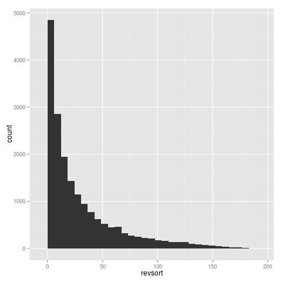

Finalmente, mostramos el histograma de _cumsort_.

```{r}
png(filename = "res/hist_cumsort.png")
ggplot(data = st, aes(x = cumsort)) + geom_histogram()
dev.off()
```

Podemos ver en la _Figura 5_ que el caso de _cumsort_ no es tan explicativo.

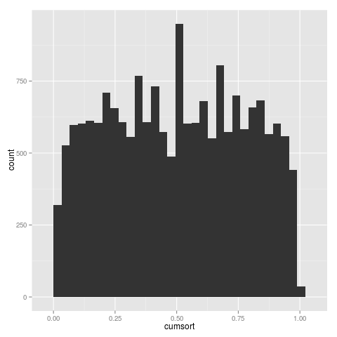

Veamos que sucede si representamos el orden (_sort_) frente a _location_, con
la componente de severidad del fallo.

```{r}
st$fs_factor <- as.factor(st$fault_severity)

png(filename = "res/location_vs_sort.png")
ggplot(data = st, aes(x = location, y = sort)) +
  geom_point(aes(color = fs_factor, alpha = fs_factor, size = fs_factor)) +
  scale_color_manual(
    name = "fault_severity",
    values = c("-1"="black", "0"="green", "1"="blue", "2"="red")) +
  scale_alpha_manual(
    legend = NULL,
    values = c("-1"=0.8, "0"=0.6, "1"=0.6, "2"=0.6)) +
  scale_size_manual(
    name = "fault_severity",
    legend = NULL,
    values = c("-1"=0.5, "0"=2, "1"=2, "2"=2))
dev.off()
```

En la _Figura 6_ podemos observar que los fallos de más severidad se producen
en las _location_ más altas, y que un _sort_ pequeño podría acotar
los fallos de baja gravedad.

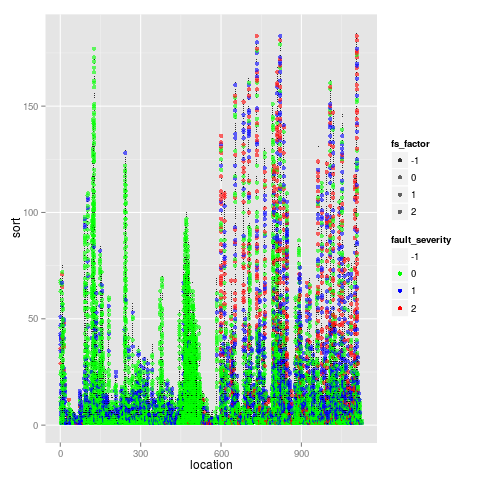

Hacemos lo mismo con el orden inverso (_revsort_).

```{r}
png(filename = "res/location_vs_revsort.png")
ggplot(data = st, aes(x = location, y = revsort)) +
  geom_point(aes(color = fs_factor, alpha = fs_factor, size = fs_factor)) +
  scale_color_manual(
    name = "fault_severity",
    values = c("-1"="black", "0"="green", "1"="blue", "2"="red")) +
  scale_alpha_manual(
    legend = NULL,
    values = c("-1"=0.8, "0"=0.6, "1"=0.6, "2"=0.6)) +
  scale_size_manual(
    name = "fault_severity",
    legend = NULL,
    values = c("-1"=0.5, "0"=2, "1"=2, "2"=2))
dev.off()
```

En la _Figura 7_ vemos que ocurre lo mismo, pero con la salvedad de que separa
mejor los fallos de gravedad 1 y 2.

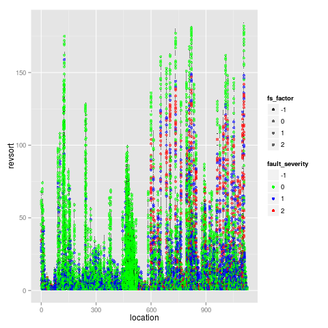

Por último veamos que ocurre con el orden acumulado (_cumsort_).

```{r}
png(filename = "res/location_vs_cumsort.png")
ggplot(data = st, aes(x = location, y = cumsort)) +
  geom_point(aes(color = fs_factor, alpha = fs_factor, size = fs_factor)) +
  scale_color_manual(
    name = "fault_severity",
    values = c("-1"="black", "0"="green", "1"="blue", "2"="red")) +
  scale_alpha_manual(
    legend = NULL,
    values = c("-1"=0.8, "0"=0.6, "1"=0.6, "2"=0.6)) +
  scale_size_manual(
    name = "fault_severity",
    legend = NULL,
    values = c("-1"=0.5, "0"=2, "1"=2, "2"=2))
dev.off()
```

Vemos en la _Figura 8_ que esta nueva variable, al normalizar la aparición
del fallo, es capaz de separarnos mucho mejor los datos por gravedad,
especialmente los fallos de gravedad 0, de los de gravedad 1 y 2 (estos últimos
concentrados en la el área rectangular que parte de la esquina superior
derecha.

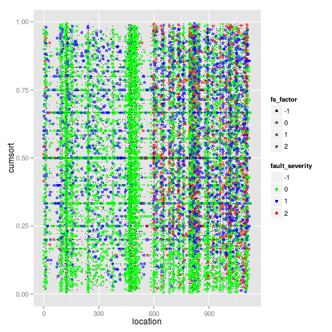

Podemos asegurar que estas nuevas variables, junto con _location_ serán muy
importante a la hora de construir nuestros modelos. Por lo tanto almacenamos
los nuevos _datasets_ en disco.

```{r}
st[, fs_factor := NULL]
st[, location := NULL]
st[, fault_severity := NULL]

write.csv(locations,
          file = "data/features/locations_feats.csv",
          quote = F,
          row.names = F)
write.csv(st,
          file = "data/features/sev_type_sort_feats.csv",
          quote = F,
          row.names = F)
```

```{r eval=T,echo=F}
require(data.table)
locations <- fread("../data/features/locations_feats.csv")
locations
```

```{r eval=T,echo=F}
require(data.table)
sev_type_sort_feats <- fread("../data/features/sev_type_sort_feats.csv")
sev_type_sort_feats
```

# Entrenando modelos

Finalmente entrenamos varios modelos, basados en distintas técnicas, para
realizar nuestras predicciones y evaluar nuestros resultados mediante
_submissions_ a la platforma _Kaggle_.

## Random Forests

En primer lugar elegimos entrenar varios _Random forests_ por tratarse de un
modelo fácil de utilizar y con resultados muy aceptables en problemas de
clasificación.

### Random Forest simple

En primer lugar elegimos un _Random Forest_ simple, con los valores por
defecto que encontramos en `randomForest`, con la única salvedad de que
en este primer intento no incluiremos las variables generadas por el _PCA_
y utilizaremos 100 árboles para generar nuestro modelo.

```{r}
library(data.table)
library(randomForest)
library(corrplot)
library(gmodels)

## Train Random Forest
trainRFModel <- function(train.data, train.class, ntrees) {
  rf.model <- randomForest(train.data, y = train.class, method = "class", 
                           ntree = ntrees, do.trace = T, na.action = na.omit)
  return(rf.model)
}

locations_feats <- fread(input = "data/features/locations_feats.csv") # This contains train and test
count_feats <- fread(input = "data/features/count_feats.csv")
min_feats <- fread(input = "data/features/min_feats.csv")
max_feats <- fread(input = "data/features/max_feats.csv")
sum_feats <- fread(input = "data/features/sum_feats.csv")
median_feats <- fread(input = "data/features/median_feats.csv")
mean_feats <- fread(input = "data/features/mean_feats.csv")
sev_type_sort_feats <- fread(input = "data/features/sev_type_sort_feats.csv")
sd_feats <- fread(input = "data/features/sd_feats.csv")
load(file = "data/features/log_features_pca.Rdata")
log_features_pca <- lf.dt.pca
rm(lf.dt.pca)

full <- merge(locations_feats, count_feats, all = T, by = "id")
full <- merge(full, min_feats, all = T, by = "id")
full <- merge(full, max_feats, all = T, by = "id")
full <- merge(full, sum_feats, all = T, by = "id")
full <- merge(full, median_feats, all = T, by = "id")
full <- merge(full, mean_feats, all = T, by = "id")
full <- merge(full, sev_type_sort_feats, all = T, by = "id")
full <- merge(full, sd_feats, all = T, by = "id")

class(full)

train <- full[full$fault_severity != -1]
test <- full[full$fault_severity == -1]

table(train$fault_severity)
train.class <- train[["fault_severity"]]
train.id <- train[["id"]]
test.id <- test[["id"]]
train[, fault_severity := NULL]
test[, fault_severity := NULL]

rf.model.000 <- trainRFModel(train, as.factor(train.class), 100)

png(filename = "res/RFImportance.000.png")
varImpPlot(rf.model.000)
dev.off()

save(rf.model.000, file = "model/rf.model.000")

pred.rf.prob <- predict(rf.model.000, test, type = "prob")
pred.rf.resp <- predict(rf.model.000, test, type = "response")

#CrossTable(test.data$y, pred.rf.resp, prop.chisq = F, prop.c = T, prop.r = F)

submission <- fread(input = "data/sample_submission.csv")
submission <- submission[order(id)]
submission <- as.data.frame(submission)
submission[, 2:4] <- pred.rf.prob

write.csv(submission, file = "res/rf.submission.000.csv", quote = F, row.names = F)
```

Estamos en la posición __452__ con un _scoring_ de __0.53791__.

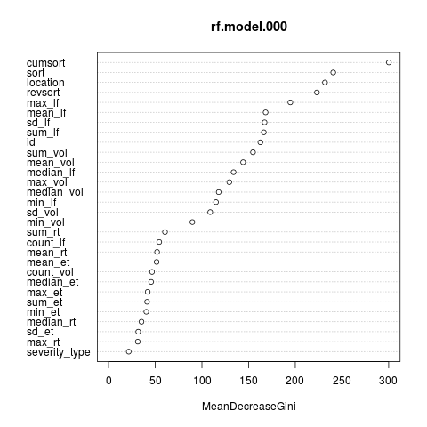

En la _Figura 9_, observamos que las variables de orden y _location_ son las
más importantes y que, a continuación los estadísticos de `log_feature.csv`
son los más descriptivos.

### Random Forest optimizado

A continuación, haciendo uso de `tuneRF` del paquete `randomForest` pasamos a
aumentar el rendimiento de nuestro bosque. Para ello generamos _random forests_
hasta que el error en _training_ sea menor del 5 por ciento, con un máximo de
100 árboles.

```{r}
rf.model.001 <- tuneRF(
  train,
  as.factor(train.class),
  mtryStart = 1,
  ntreeTry = 100,
  improve = 0.05,
  trace = T,
  plot = T,
  doBest = T)

png(filename = "res/RFImportance.001.png")
varImpPlot(rf.model.001)
dev.off()

save(rf.model.001, file = "model/rf.model.001")

pred.rf.prob <- predict(rf.model.001, test, type = "prob")
pred.rf.resp <- predict(rf.model.001, test, type = "response")

#CrossTable(test.data$y, pred.rf.resp, prop.chisq = F, prop.c = T, prop.r = F)

submission <- fread(input = "data/sample_submission.csv")
submission <- submission[order(id)]
submission <- as.data.frame(submission)
submission[, 2:4] <- pred.rf.prob

write.csv(submission, file = "res/rf.submission.001.csv", quote = F, row.names = F)
```

Estamos en la posición __67__ con un _scoring_ de __0.44174__.

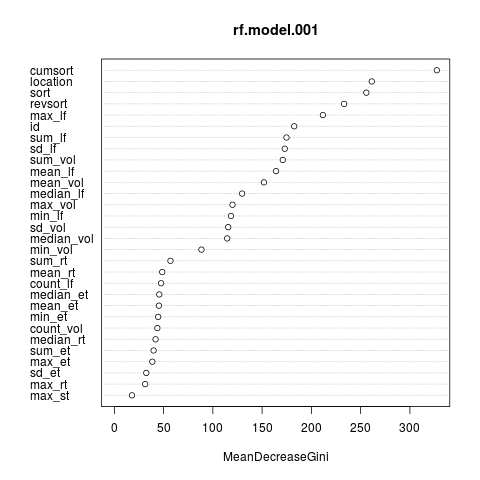

En la _Figura 10_ vemos que las variables con más importancia siguen siendo
las de orden y _location_, pero en este caso parece que _id_ ha desplazado
a algunos estadísticos de `log_feature.csv`.

### Random Forest optimizado y PCAs

El siguiente _random forest_ tendrá las mismas características que el anterior,
pero en este caso añadiremos las 5 primeras componentes principales al
_dataset_ que estamos utilizando para el entrenamiento y la predicción.

```{r}
best_5_pcs <- log_features_pca[, 1:6, with = F]

full <- merge(locations_feats, count_feats, all = T, by = "id")
full <- merge(full, min_feats, all = T, by = "id")
full <- merge(full, max_feats, all = T, by = "id")
full <- merge(full, sum_feats, all = T, by = "id")
full <- merge(full, median_feats, all = T, by = "id")
full <- merge(full, mean_feats, all = T, by = "id")
full <- merge(full, sev_type_sort_feats, all = T, by = "id")
full <- merge(full, sd_feats, all = T, by = "id")
full <- merge(full, best_5_pcs, all = T, by = "id")

train <- full[full$fault_severity != -1]
test <- full[full$fault_severity == -1]

train.class <- train[["fault_severity"]]
train.id <- train[["id"]]
test.id <- test[["id"]]
train[, fault_severity := NULL]
test[, fault_severity := NULL]

rf.model.002 <- tuneRF(
  train,
  as.factor(train.class),
  mtryStart = 1,
  ntreeTry = 100,
  improve = 0.05,
  trace = T,
  plot = T,
  doBest = T)

png(filename = "res/RFImportance.002.png")
varImpPlot(rf.model.002)
dev.off()

save(rf.model.002, file = "model/rf.model.002")

pred.rf.prob <- predict(rf.model.002, test, type = "prob")
pred.rf.resp <- predict(rf.model.002, test, type = "response")

#CrossTable(test.data$y, pred.rf.resp, prop.chisq = F, prop.c = T, prop.r = F)

submission <- fread(input = "data/sample_submission.csv")
submission <- submission[order(id)]
submission <- as.data.frame(submission)
submission[, 2:4] <- pred.rf.prob

write.csv(submission, file = "res/rf.submission.002.csv", quote = F, row.names = F)
```

Estamos en la posición __67__ con un _scoring_ de __0.44258__. Aunque nos
mantenemos en la misma posición, nuestra puntuación ha descendido, por lo que
la introducción de las variables obtenidas por el método del __PCA__ no parecen
que le aporten mayor información a nuestro modelo. Realmente, el _scoring_ es
peor que el anterior.

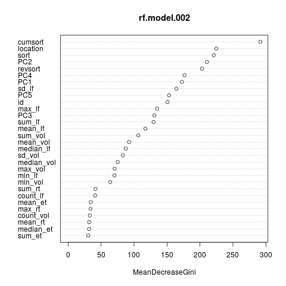

Las variables que más importancia tienen en nuestro modelo son las usuales hasta
ahora, pero en este caso parece que los estadísticos han sido desplazados por
las componentes principales, como se puede observar en la _Figura 11_.

### Forzando el Random Forest

Por último, forzamos la generación de un _random forest_ con 1000 árboles y
un error menor del 5 por 1000 (lo que generará) errores con respecto al
_dataset_ de _training_.

```{r}
best_5_pcs <- log_features_pca[, 1:6, with = F]

full <- merge(locations_feats, count_feats, all = T, by = "id")
full <- merge(full, min_feats, all = T, by = "id")
full <- merge(full, max_feats, all = T, by = "id")
full <- merge(full, sum_feats, all = T, by = "id")
full <- merge(full, median_feats, all = T, by = "id")
full <- merge(full, mean_feats, all = T, by = "id")
full <- merge(full, sev_type_sort_feats, all = T, by = "id")
full <- merge(full, sd_feats, all = T, by = "id")
full <- merge(full, best_5_pcs, all = T, by = "id")

train <- full[full$fault_severity != -1]
test <- full[full$fault_severity == -1]

train.class <- train[["fault_severity"]]
train.id <- train[["id"]]
test.id <- test[["id"]]
train[, fault_severity := NULL]
test[, fault_severity := NULL]

rf.model.003 <- tuneRF(
  train,
  as.factor(train.class),
  mtryStart = 1,
  ntreeTry = 1000,
  improve = 0.005,
  trace = T,
  plot = T,
  doBest = T)

png(filename = "res/RFImportance.003.png")
varImpPlot(rf.model.003)
dev.off()

save(rf.model.003, file = "model/rf.model.003")

pred.rf.prob <- predict(rf.model.003, test, type = "prob")
pred.rf.resp <- predict(rf.model.003, test, type = "response")

#CrossTable(test.data$y, pred.rf.resp, prop.chisq = F, prop.c = T, prop.r = F)

submission <- fread(input = "data/sample_submission.csv")
submission <- submission[order(id)]
submission <- as.data.frame(submission)
submission[, 2:4] <- pred.rf.prob

write.csv(submission, file = "res/rf.submission.003.csv", quote = F, row.names = F)
```

Estamos en la posición __70__ con un _scoring_ de __0.44474__. Aunque cabría
esperar una mejor puntuación, vemos que hemos descendido en el _leaderboard_.
Esto puede deberse a que a partir de cierto punto, nuestro modelo deja de ser
útil para predecir variables que no se encuentren en nuestro _dataset_ de
_training_. Podríamos estar entrando en el terreno del _overfitting_.

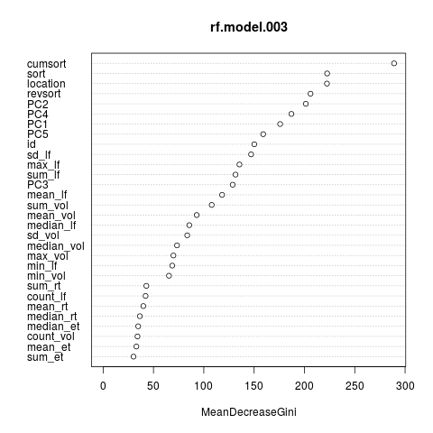

En este caso, las variables que más importancia tienen en nuestro modelo son
las que se muestran en la _Figura 12_. Como se puede observar, el orden,
_location_ y las componentes principales han tomado la mayor importancia.

## Support Vector Machines

Cambiando el enfoque, vamos a probar con la técnica de _Support Vector Machines_.
Aunque más costosa en recursos, bien ajustada, puede proporcionar muy buenos
resultados en problemas de clasificación.

Entrenamos este modelo utilizando k-5 _cross validation_ (en los _random forest_
se aplica por defecto) con un _kernel_ Gaussiano.

```{r}
require(kernlab)

best_5_pcs <- log_features_pca[, 1:6, with = F]

full <- merge(locations_feats, count_feats, all = T, by = "id")
full <- merge(full, min_feats, all = T, by = "id")
full <- merge(full, max_feats, all = T, by = "id")
full <- merge(full, sum_feats, all = T, by = "id")
full <- merge(full, median_feats, all = T, by = "id")
full <- merge(full, mean_feats, all = T, by = "id")
full <- merge(full, sev_type_sort_feats, all = T, by = "id")
full <- merge(full, sd_feats, all = T, by = "id")
full <- merge(full, best_5_pcs, all = T, by = "id")

train <- full[full$fault_severity != -1]
test <- full[full$fault_severity == -1]

train[, id := NULL]
test[, id := NULL]

svm.model.000 <- ksvm(
  as.factor(fault_severity) ~ .,
  data = train,
  cross = 5,
  kernel = "rbfdot",
  prob.model = T)

save(svm.model.000, file = "model/svm.model.000")

pred.svm.prob <- predict(svm.model.000, test, type = "prob")
pred.svm.resp <- predict(svm.model.000, test, type = "response")

submission <- fread(input = "data/sample_submission.csv")
submission <- submission[order(id)]
submission <- as.data.frame(submission)
submission[, 2:4] <- pred.svm.prob

write.csv(submission, file = "res/svm.submission.000.csv", quote = F, row.names = F)
```

Estamos en la posición __684__ con un _scoring_ de __0.68356__. Podemos aceptar
que en este caso __SVM__ no es una técnica que se adapte bien a nuestro caso,
ya que, aunque no aparezca en este documento, se probó con distintos _kernels_,
tales como _vanilladot_ (lineal) y _polydot_ (polinomial) y ambos se quedaron
atascados buscando nuevas variables, después de una ejecución de varias horas.

## Gradient Boosting

Las técnicas de _gradient boosting_, tales como _xgboost_ o _gamboost_ suelen
proporcionar buenos resultados en modelos predictivos para funciones de pérdida
(_loss_), tales como la función de evaluación aplicada en esta competición
para medir la bondad del modelo. Por esa razón hemos optado por crear un modelo
en base a la técnica _xgboost_ con _cross-validation_ mediante el paquete
`xgboost`. Los parámetros que hemos decidido para nuestro modelo son:

* Evaluación _mlogloss_ por ser la utilizada para evaluar la predicción en
_Kaggle_.
* Una tasa de aprendizaje de $0.05$, ya que los valores pequeños previenen
el _overfitting_.
* Una proporción de muestreo del 70 por ciento.
* Una proporción de columnas al construir los árboles del 85 por ciento.
* Como objetivo utilizamos `multi:softprob` que devuelve una clasificación
multiclase con resultado de probabilidades.
* Por último realizaremos 1000 pasadas con k-10 _cross validation_.

```{r}
require(xgboost)

best_5_pcs <- log_features_pca[, 1:6, with = F]

full <- merge(locations_feats, count_feats, all = T, by = "id")
full <- merge(full, min_feats, all = T, by = "id")
full <- merge(full, max_feats, all = T, by = "id")
full <- merge(full, sum_feats, all = T, by = "id")
full <- merge(full, median_feats, all = T, by = "id")
full <- merge(full, mean_feats, all = T, by = "id")
full <- merge(full, sev_type_sort_feats, all = T, by = "id")
full <- merge(full, sd_feats, all = T, by = "id")
full <- merge(full, best_15_pcs, all = T, by = "id")

train <- full[full$fault_severity != -1]
test <- full[full$fault_severity == -1]

train.class <- train[["fault_severity"]]
train.id <- train[["id"]]
test.id <- test[["id"]]
train[, fault_severity := NULL]
test[, fault_severity := NULL]

params <- list(
  eval_metric = 'mlogloss',
  num_class = max(train.class) + 1,
  eta = 0.05,
  subsample = 0.7,
  colsample_bytree = 0.85,
  objective = 'multi:softprob',
  gamma = 0.1,
  lambda=0.9)

best.xgbcv <- xgb.cv(
  params = params,
  data = data.matrix(train),
  label = train.class, 
  nfold = 10,
  nrounds = 1000,
  print.every.n = 10,
  early.stop.round=100)

NROUNDS <- which.min(best.xgbcv$train.mlogloss.mean)

xgb.model.000 <- xgboost(
  params = params,
  data = data.matrix(train),
  label = train.class,
  nrounds=NROUNDS,
  print.every.n = 100)

xgb.save(xgb.model.000, fname = "model/xgb.model.000")
# xgb.model.000 <- xgb.load(modelfile = "model/xgb.model.000")

pred.xgb.prob <- predict(xgb.model.000, data.matrix(test))

pred.xgb.prob <- matrix(pred.xgb.prob, ncol = 3, byrow = T)

submission <- fread(input = "data/sample_submission.csv")
submission <- submission[order(id)]
submission <- as.data.frame(submission)
submission[, 2:4] <- pred.xgb.prob

write.csv(submission, file = "res/xgb.submission.000.csv", quote = F, row.names = F)
```

Estamos en la posición __70__ con un _scoring_ de __0.44586__.

## Ensembles

Finalmente, vamos a combinar los dos modelos que mejores resultados han
obtenido: `xgb.model.000` con un _scoring_ de __0.44586__ y `rf.model.001` con
un _scoring_ de __0.44174__. Para ello balanceramos las predicciones aunque
sin llevar a ninguna de las dos a los extremos, ya que las puntuaciones
obtenidas con ambos modelos son muy parecidas.

```{r}
xgb.submission.000 <- fread("res/xgb.submission.000.csv", data.table = F)
rf.submission.001 <- fread("res/rf.submission.001.csv", data.table = F)

submission <- xgb.submission.000

submission[, 2:4] <- 0.5 * xgb.submission.000[, 2:4] + 0.5 * rf.submission.001[, 2:4]
write.csv(submission, file = "res/ens.submission.000.csv", quote = F, row.names = F)
```

Estamos en la posición __67__ con un _scoring_ de __0.44238__.

```{r}
submission[, 2:4] <- 0.4 * xgb.submission.000[, 2:4] + 0.6 * rf.submission.001[, 2:4]
write.csv(submission, file = "res/ens.submission.001.csv", quote = F, row.names = F)
```

Estamos en la posición __70__ con un _scoring_ de __0.44474__.

```{r}
submission[, 2:4] <- 0.3 * xgb.submission.000[, 2:4] + 0.7 * rf.submission.001[, 2:4]
write.csv(submission, file = "res/ens.submission.002.csv", quote = F, row.names = F)
```

Estamos en la posición __71__ con un _scoring_ de __0.44793__.

```{r}
submission[, 2:4] <- 0.6 * xgb.submission.000[, 2:4] + 0.4 * rf.submission.003[, 2:4]
write.csv(submission, file = "res/ens.submission.003.csv", quote = F, row.names = F)
```

Estamos en la posición __67__ con un _scoring_ de __0.44071__.

```{r}
submission[, 2:4] <- 0.7 * xgb.submission.000[, 2:4] + 0.3 * rf.submission.003[, 2:4]
write.csv(submission, file = "res/ens.submission.004.csv", quote = F, row.names = F)
```

Estamos en la posición __67__ con un _scoring_ de __0.44016__.

```{r}
submission[, 2:4] <- 0.8 * xgb.submission.000[, 2:4] + 0.2 * rf.submission.003[, 2:4]
write.csv(submission, file = "res/ens.submission.005.csv", quote = F, row.names = F)
```

Estamos en la posición __67__ con un _scoring_ de __0.44061__.

Como cabía esperar, la combinación de ambos modelos, aunque modestamente, nos
proporciona mejores resultados que los dos por separado. Aunque,
inesperadamente, parece que al ofrecer mayor peso en el _ensemble_ al modelo
que obtuvo peor _scoring_ obtenemos mejores resultados.

# Conclusiones

Como conclusión final al proyecto realizado, cabe destacar que el puesto __67__
de __974__ participantes con un _scoring_ de __0.44061__ es buen lugar para
una primera aproximación al problema. Más aún, teniendo en cuenta que la
competición había finalizado cuando se realizarón las _submissions_, además
de que muchos participantes han publicado sus soluciones, en las que, en
algunos casos, han sido de mucha utilidad para la realización de este ejercicio.

El mayor grado de complejidad en el desarrollo del proyecto está en la
elaboración de _datasets_ adecuados para su tratamiento, generando variables
útiles que permitan aumentar la tasa de clasificación, ya que los _datasets_
originales son poco descriptivos y no demasiado útiles.

Finalmente, como mejoras posibles al proyecto, me gustaría añadir que se
podría continuar por dos vías distintas para mejorar el _scoring_ obtenido:

1. Creación de nuevas variables más descriptivas, como por ejemplo buscar
patrones en la aparición de _features_ por __id__ y otorgar un valor a las
combinaciones de _features_ que más se repitan para los distintos grados de
fallo.
2. Entrenamiento de un mayor número de instancias del mismo modelo y obtención
de los resultados de predicción basados en la media de los resultados obtenidos
por cada una de las instancias: por ejemplo, entrenar 1000 _random forests_
con las mismas características y obtener como resultado de la predicción
la media de los obtenidos por las 1000 instancias, cruzando estos resultados
con el resultado obtenido aplicando el mismo método, por ejemplo, usando
_xgboost_ y realizar la _submission_ del resultado final.

[^1]: https://www.kaggle.com/c/telstra-recruiting-network
[^2]: https://www.rstudio.com/
[^3]: https://en.wikipedia.org/wiki/Bessel%27s_correction
[^4]: https://en.wikipedia.org/wiki/Gradient_boosting
[^5]: https://en.wikipedia.org/wiki/Principal_component_analysis